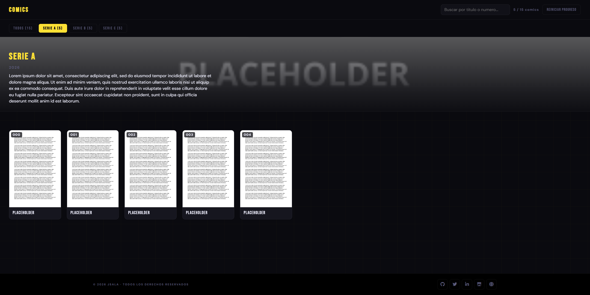

# Comic Shelf

Self-hosted comic book (CBR/CBZ) reading server. A lightweight web UI with a built-in reader, cached covers, and persistent reading progress, run your own comics library without relying on external services.

## Screenshot
 


## Features

- **CBR/CBZ support** in the browser via `libarchive.js` (WASM) archives are extracted client-side, no conversion step required.
- **Series-based browsing** organize your library by series, each in its own folder.
- **Lazy-loaded covers** cover thumbnails are only extracted and requested as they scroll into view, not all at once.
- **Server-side cover caching** once a cover is extracted, it's resized, recompressed as JPEG, and cached on disk so it never has to be re-extracted from the archive again.
- **Persistent reading progress** the last page read per comic is saved in `localStorage`, so you can pick up right where you left off.
- **Full-screen page reader** with page prefetching for smooth navigation.
- **RAR filter fallback** comics using unsupported RAR compression filters are automatically converted server-side so they can still be read.

## Requirements

You need a PHP-capable web server. Two supported options:

1. **XAMPP** (or any Apache + PHP stack) the simplest option if you already have it installed.
2. **Bundled Python server** (`php_server.py`) a minimal, dependency-free alternative that serves static files and runs `.php` scripts through `php-cgi`, with no need to install a full Apache stack.
   - Requires [PHP](https://www.php.net/downloads) with `php-cgi` available (see comments at the top of `php_server.py` for per-OS install instructions).

## Getting started

1. Clone this repository into your server's web root (or anywhere, if using the bundled Python server).
2. Drop your comic archives into the `comics/` folder, organized as:
   ```
   comics/
     <series>/
       issue-01.cbz
       issue-02.cbr
   ```
3. Start the server:
   - **XAMPP**: place the project in `htdocs/` and start Apache from the XAMPP control panel.
   - **Bundled server**: `python php_server.py` (edit the `PHP_CGI` path at the top of the file if `php-cgi` isn't on your system `PATH`).
4. Open `http://localhost/` in your browser.

## Configuration

- **Category banners** (background image, years, synopsis) are configured in `data/category-info.json`.
- **Category images** default to `images/categories/<CategoryName>.jpg`, or can be overridden per-category in the JSON above.
- Cover thumbnail size and quality can be tuned in `js/app.js` (`COVER_MAX_WIDTH`, `COVER_MAX_HEIGHT`, `COVER_JPEG_QUALITY`).

## Project structure

```
├── api/                 # PHP backend (listing, cover caching)
├── css/                 # Stylesheet
├── data/                # category-info.json
├── images/categories/   # Category banner images
├── js/                  # Frontend app + vendored libarchive.js
├── comics/              # Your comic library (series/archive.cbr)
├── php_server.py        # Optional standalone Python server
└── index.html
```

## License

Licensed under the [MIT License](LICENSE).

Note: this license covers the project's own code only. Comics you place under `lectura/` are your own content and are not covered by this license. `libarchive.js` (in `js/vendor/`) is a third-party dependency check its own license before redistributing.